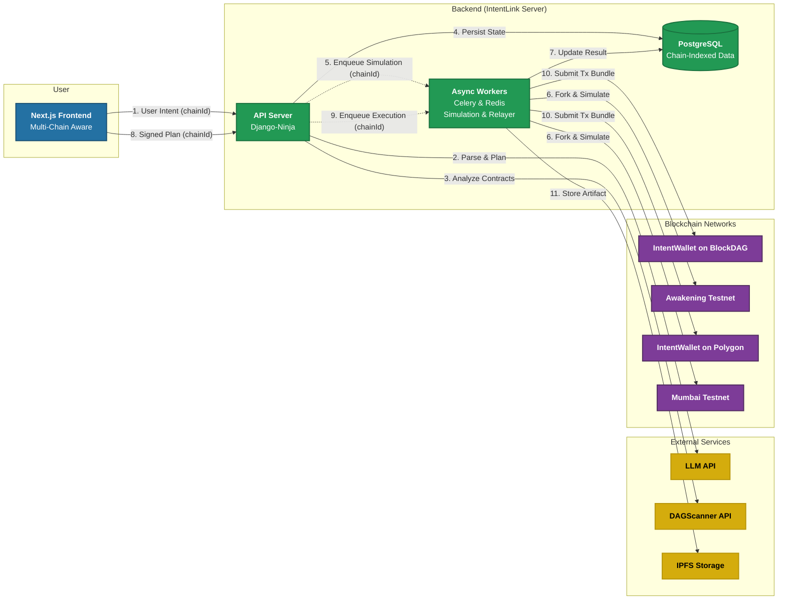

<!-- PROJECT BANNER -->

  

 

<h1 align="center">🚀 IntentLink</h1>
<h3 align="center">Your AI Copilot for Secure, Multi-Chain DeFi on BlockDAG</h3>

  <!-- GitHub Badges -->
  
  
  <!-- Project Badges -->
  
  

---

## 🎯 The Problem: DeFi is Powerful, but Dangerously Complex

Interacting with DeFi involves navigating a maze of disjointed interfaces, technical jargon (gas, slippage, approvals), and a constant threat of scams or contract exploits. A simple goal like "move my assets to the best-yielding farm" can require 5-10 manual, error-prone steps, exposing users to significant financial risk. This complexity is the single biggest barrier to mass adoption.

## ✨ Our Solution: IntentLink

> IntentLink is a **secure, AI-driven execution layer** that translates your natural language goals into safe, optimized, multi-chain transactions. We replace the complex multi-step process with a single, verifiable "intent."

Simply state what you want to do. Our backend pipeline does the heavy lifting:

1.  **Parses** your intent into a machine-readable format.
2.  **Plans** the optimal transaction path across multiple protocols (DEXs, Staking, Lending), vetting all contracts with [DAGScanner](https://github.com/SheriffMudasir/DAGScannser-Backend).
3.  **Simulates** the entire plan on a fork of the target network to guarantee success and predict outcomes.
4.  **Presents** a clear, human-readable summary for your final, single-signature approval.

**IntentLink = 🧠 AI Planner + 🛡️ Multi-Chain Simulation Engine + 🛡️ DAGScanner Security + ⚡ Ultra-fast BlockDAG Execution**

---

## 🏆 Our Vision 

We are building IntentLink to directly meet and exceed the requirements of the DeFi Speedway track.

*   ✅ **Sub-2 Second Transactions:** By leveraging BlockDAG's high-throughput architecture and a streamlined intent-to-execution pipeline, we aim to demonstrate that complex DeFi strategies can be executed with near-instantaneous finality from the user's perspective.
*   ✅ **Three Core DeFi Protocols:** Our architecture is designed from the ground up to support a diverse range of DeFi primitives. For this hackathon, we will explicitly implement and demonstrate intents for:
    1.  **DEXs** (e.g., "Swap 1000 BDAG for USDC")
    2.  **Staking** (e.g., "Stake my USDC in the highest-APY farm")
    3.  **Lending** (e.g., "Lend 500 USDC on the most trusted protocol")
*   ✅ **Multi-Chain Support:** DeFi is not a single-chain world. IntentLink is architected to be chain-agnostic. We will demonstrate intent execution on **BlockDAG's Awakening Testnet** as our primary, high-speed chain, and a second EVM network (like **Polygon Mumbai**) to prove the flexibility and scalability of our solution.

---

## 🔑 Key Features

- 🗣️ **Natural Language Intents:** Just say what you want, like "Swap 500 BDAG for USDC and lend it on the top protocol."
- 🔗 **Multi-Chain by Design:** Natively manage and execute strategies across BlockDAG, Polygon, and other EVM networks from a single interface.
- 🔒 **Security-First Pipeline:** Every transaction is simulated and every contract is vetted by DAGScanner _before_ you sign anything.
- ⛽️ **Gas Abstraction & Sponsorship:** The IntentLink relayer can handle gas fees, simplifying the user experience and enabling sponsored transactions.
- 📦 **Atomic Execution:** Multi-step plans are bundled into a single transaction via an Account Abstraction wallet. If one step fails, the entire operation reverts, preventing lost funds.
- 🧾 **On-Chain Audits:** Every executed intent generates an on-chain receipt with a link to an IPFS artifact containing the full plan, DAGScanner report, and simulation logs.

---

## 🏗️ System Architecture & Tech Stack

Our architecture is a robust, three-layer system designed for security, scalability, and multi-chain support.

### **Tech Stack**

-   **Backend:** Django 4.x, Django-Ninja, Celery, Redis, PostgreSQL
-   **Frontend:** Next.js, Ethers.js, RainbowKit/Wagmi
-   **Smart Contracts:** Solidity, Hardhat, OpenZeppelin
-   **Infrastructure:** Docker, Gunicorn, Nginx
-   **External Services:** Google Agent Dev Kit (LLM), DAGScanner, Pinata (IPFS)

---

## 🚀 Getting Started

This project is a monorepo containing the `intentlink-backend`, `intentlink-frontend`, and `intentlink-contracts` directories.

### **Backend**

1.  Navigate to the `intentlink-backend` directory: `cd intentlink-backend`
2.  Create your local environment file: `cp .env.example .env`
3.  Fill in the required variables in `.env`.
4.  Start the services: `docker-compose up --build -d`

For more details, see the README inside the `intentlink-backend` directory.
