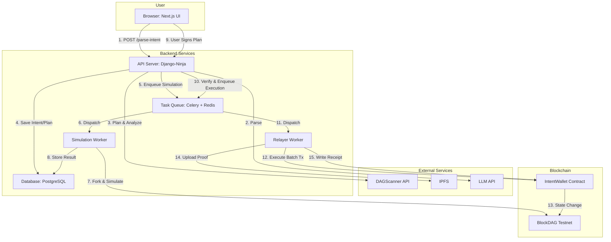

<!-- PROJECT BANNER -->

  

 

<h1 align="center">🚀 IntentLink</h1>
<h3 align="center">Your AI Copilot for Secure DeFi Transactions on BlockDAG</h3>

  <!-- GitHub Badges -->
  
  
  <!-- Project Badges -->
  
  

---

## 🎯 The Problem: DeFi is Powerful, but Dangerously Complex

Interacting with DeFi involves navigating a maze of disjointed interfaces, technical jargon (gas, slippage, approvals), and a constant threat of scams or contract exploits. A simple goal like "move my assets to the best-yielding farm" can require 5-10 manual, error-prone steps, exposing users to significant financial risk.

## ✨ Our Solution: IntentLink

> IntentLink is a **secure, AI-driven execution layer** that translates your natural language goals into safe, optimized on-chain transactions. We replace the complex multi-step process with a single, verifiable "intent."

Simply state what you want to do. Our backend pipeline does the heavy lifting:

1.  **Parses** your intent into a machine-readable format.
2.  **Plans** the optimal transaction path, vetting all contracts with **DAGScanner**.
3.  **Simulates** the entire plan on a fork of the BlockDAG network to guarantee success.
4.  **Presents** a clear, human-readable summary for your final, single-signature approval.

**IntentLink = 🧠 AI Planner + 🛡️ Simulation Engine + ⚔️🛡️ Security-First by DAGScanner + ⚡ Ultra-fast BlockDAG Execution**

---

## 🔑 Key Features

- 🗣️ **Natural Language Input:** Just say what you want, like "Swap 500 BDAG for USDC and lend it on the top protocol."
- 🔒 **Security-First Pipeline:** Every transaction is simulated and every contract is vetted by DAGScanner _before_ you sign anything.
- ⛽️ **Gas Abstraction:** The IntentLink relayer handles gas fees, simplifying the user experience.
- 📦 **Atomic Execution:** Multi-step plans are bundled into a single transaction. If one step fails, the entire operation reverts, preventing lost funds.
- 🧾 **On-Chain Audits:** Every executed intent generates an on-chain receipt with a link to an IPFS artifact containing the full plan and simulation logs.

---

## 🏗️ System Architecture

Our architecture is a robust, three-layer system designed for security and scalability.

