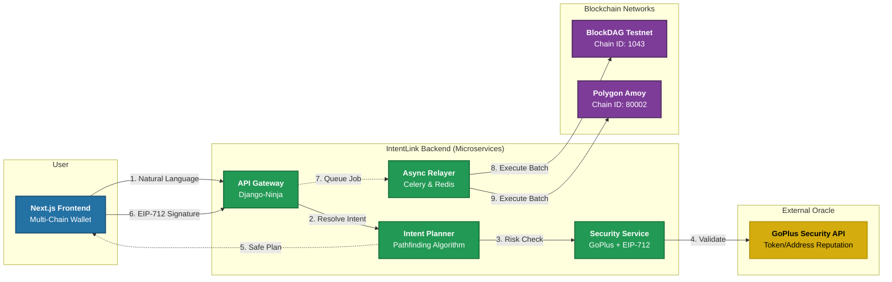

<!-- PROJECT BANNER -->
<p align="center">
  <a href="https://github.com/SheriffMudasir/IntentLink">
    
  </a>
</p>

<br />

<h1 align="center">🚀 IntentLink</h1>
<h3 align="center">The Intent-Centric Execution Layer for BlockDAG</h3>
<p align="center"><b>Speed of BlockDAG ⚡️ + Safety of GoPlus 🛡️ + EIP-712 Security 🔐</b></p>

<p align="center">
  <!-- GitHub Badges -->
  <a href="https://github.com/SheriffMudasir/IntentLink/stargazers">
    
  </a>
  <a href="https://github.com/SheriffMudasir/IntentLink/blob/main/LICENSE">
    
  </a>
  <!-- Project Badges -->
  <a href="https://blockdag.network/hackathon">
    
  </a>
  
  
</p>

---

## 📺 **Demo Video**
**[Click here to watch the End-to-End Demo (Parse → Plan → Execute)](https://youtu.be/dRfsjRN5FBg)**  
*(Demonstrating live backend integration, GoPlus security checks, and BlockDAG testnet execution)*

---

## 📁 Project Structure

```
IntentLink/
├── intentlink-backend/        # Django-Ninja API, Celery workers, Smart Contracts
│   ├── api_v1/                # REST API endpoints
│   ├── services/              # Core business logic (AI, Security, Signature)
│   ├── intentlink-contracts/  # Solidity smart contracts
│   └── docker-compose.yml     # Full stack orchestration
├── intentlink-frontend/       # Next.js 15 application
│   └── intentlink/            # React components, hooks, contexts
└── assets/                    # Project assets and documentation
```

---

## 🎯 The Problem: DeFi is Too Hard & Too Risky

For mass adoption, DeFi needs to stop acting like a command line and start acting like a concierge. Currently, a user wanting to "Earn yield on BlockDAG" faces a maze:
1.  Find a protocol (High risk of phishing).
2.  Check contract safety (Manual, error-prone).
3.  Approve tokens (Gas cost).
4.  Stake tokens (Gas cost).
5.  Repeat for every chain.

**The Complexity Gap:** Users want **outcomes** (Yield, Swaps), but Blockchains require **steps** (Call data, nonces, gas).

## ✨ The Solution: IntentLink

IntentLink is a **secure, multi-chain intent execution layer**. We decouple the *what* (User Intent) from the *how* (Transaction Execution).

1.  **User:** "Stake 1000 BDAG in the safest farm."
2.  **IntentLink:** Parses the intent, scans protocols, validates security via **GoPlus**, and constructs a transaction bundle.
3.  **User:** Signs **one** EIP-712 typed message.
4.  **BlockDAG:** Executes the bundle instantly via Account Abstraction.

---

## 🧱 Scalability & Architecture

We addressed scalability by adopting a hybrid **Off-Chain Solving / On-Chain Settlement** model.

### The "Speed + Safety" Stack
*   **Execution:** Built on **BlockDAG** to leverage its **2-second finality**. Intents expire quickly; BlockDAG ensures they settle before market conditions change.
*   **Security:** Integrated **GoPlus Security API** (Token & Address Security) + **EIP-712 Signature Verification** for cryptographic user consent.
*   **Throughput:** The Intent Engine runs off-chain using **Celery & Redis** worker queues, allowing us to process thousands of intents per second without clogging the network.

### System Architecture



---

## ✅ Implementation Status

| Phase | Status | Description |
| :--- | :--- | :--- |
| **Phase 1: Core Intent Pipeline** | ✅ Complete | Intent parsing, API, PostgreSQL, Docker |
| **Phase 2: Security Validation** | ✅ Complete | GoPlus integration, honeypot detection, safety scoring |
| **Phase 3: Multi-Chain Support** | ✅ Complete | BlockDAG (1043) & Polygon Amoy (80002) |
| **Phase 4: Cryptographic Security** | ✅ Complete | EIP-712 signatures, chain-specific binding |
| **Phase 5: Logging & Monitoring** | ✅ Complete | Comprehensive audit trails |
| **Phase 6: On-Chain Execution** | 🔄 In Progress | Web3.py transactions, relayer service |
| **Phase 7: Production Hardening** | 📋 Planned | Rate limiting, CI/CD, monitoring |

---

## 🌐 Supported Networks

| Network | Chain ID | Status | Contracts |
| :--- | :--- | :--- | :--- |
| **BlockDAG Awakening Testnet** | 1043 | 🟢 Live | IntentWallet, MockDEX, MockStaking, MockLending |
| **Polygon Amoy Testnet** | 80002 | 🟢 Live | IntentWallet, MockDEX, MockStaking, MockLending |

---

## 🛠 Tech Stack

### Backend
-   **Framework:** Python 3.11, Django 4.x, Django-Ninja
-   **Async Queue:** Celery + Redis
-   **Database:** PostgreSQL 15
-   **Cryptography:** eth-account, Web3.py (EIP-712)
-   **Security Oracle:** GoPlus Security API

### Frontend
-   **Framework:** Next.js 15.5, React 19
-   **Styling:** Tailwind CSS 4, Framer Motion
-   **Web3:** Ethers.js 6
-   **Components:** Radix UI, Lucide Icons

### Smart Contracts
-   **Language:** Solidity
-   **Networks:** BlockDAG, Polygon

---

## 🚀 Getting Started

### Prerequisites
- Docker & Docker Compose
- Node.js 18+ (for frontend)
- Git

### Backend Setup

```bash
# Clone the repository
git clone https://github.com/SheriffMudasir/IntentLink.git
cd IntentLink/intentlink-backend

# Configure environment
cp .env.example .env
# Edit .env with your API keys (GOPLUS_API_KEY, RPC URLs, etc.)

# Launch all services
docker-compose up --build -d

# Access API documentation
# Open http://localhost:8000/api/docs
```

### Frontend Setup

```bash
cd IntentLink/intentlink-frontend/intentlink

# Install dependencies
npm install

# Configure environment
cp .env.example .env.local
# Edit .env.local with your backend API URL

# Run development server
npm run dev

# Open http://localhost:3000
```

---

## 📡 API Endpoints

| Endpoint | Method | Description |
| :--- | :--- | :--- |
| `/api/parse/` | POST | Parse natural language into structured intent |
| `/api/plan/` | POST | Generate execution plan with security checks |
| `/api/prepare-signature/` | POST | Generate EIP-712 payload for signing |
| `/api/submit-intent/` | POST | Submit signed intent for execution |
| `/api/status/{id}/` | GET | Check execution status |
| `/api/portfolio/` | GET | Get user portfolio (multi-chain) |
| `/api/docs` | GET | Interactive Swagger documentation |

---

## 🔐 Security Features

- **EIP-712 Typed Data Signing** - Cryptographic proof of user consent
- **GoPlus Integration** - Real-time honeypot and malicious contract detection
- **Chain-Specific Signatures** - Prevents cross-chain replay attacks
- **Whitelisted Protocols** - Only pre-approved contracts can be used
- **Time-Limited Authorization** - 1-hour signature expiry
- **Comprehensive Audit Logging** - Full request tracing

---

## 🔮 Roadmap

| Wave | Focus | Status |
| :--- | :--- | :--- |
| **Wave 1-2** | MVP, GoPlus Integration | ✅ Complete |
| **Wave 3** | Multi-Chain, EIP-712 Security | ✅ Complete |
| **Wave 4** | Live Relayer, Real Transactions | 🔄 In Progress |
| **Wave 5** | AI-Agent Integration (ADK) | 📋 Planned |
| **Wave 6** | Audits & Production Launch | 📋 Planned |

---

## 📚 Documentation

- [Backend README](./intentlink-backend/README.md) - Detailed API documentation
- [Smart Contracts](./intentlink-backend/intentlink-contracts/README.md) - Solidity contracts & deployment
- [Frontend Guide](./intentlink-frontend/README.md) - Next.js application setup

---

## 🤝 Contributing

We welcome contributions! Please see our contributing guidelines (coming soon).

---

## 📄 License

This project is licensed under the MIT License - see the [LICENSE](LICENSE) file for details.

---

<p align="center">Built with ❤️ for the BlockDAG Ecosystem</p>
<p align="center">
  <a href="https://blockdag.network">BlockDAG</a> •
  <a href="https://gopluslabs.io">GoPlus Security</a>
</p>
